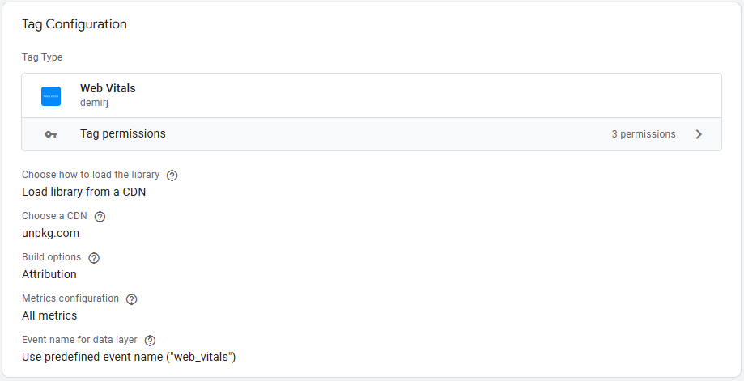
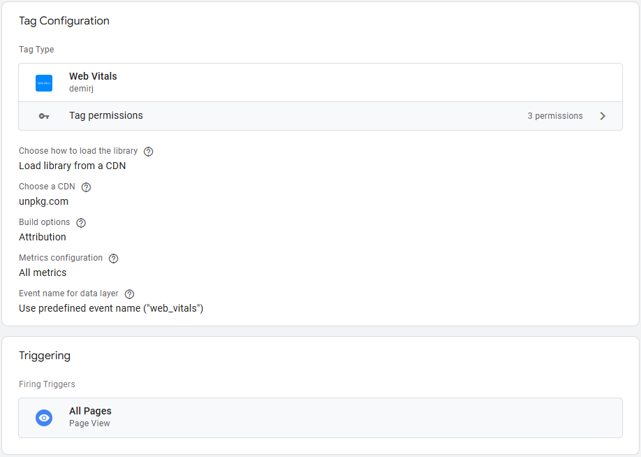
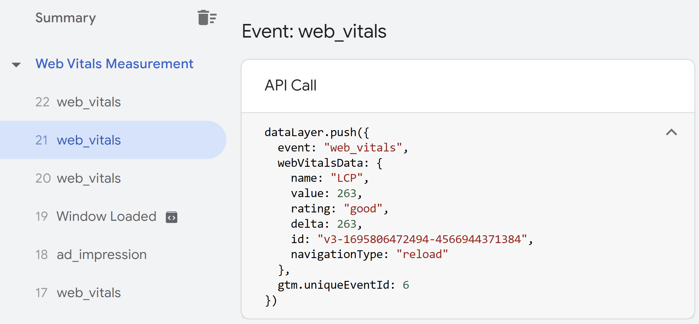
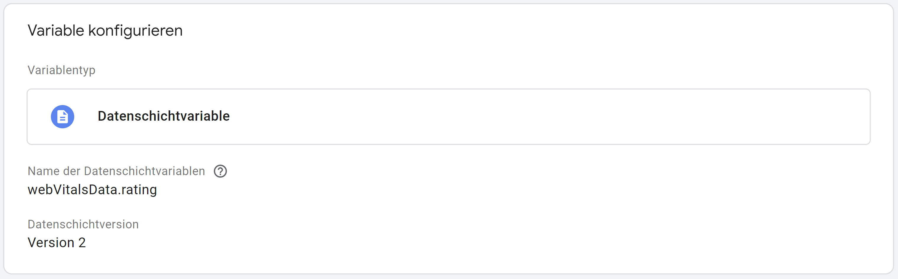
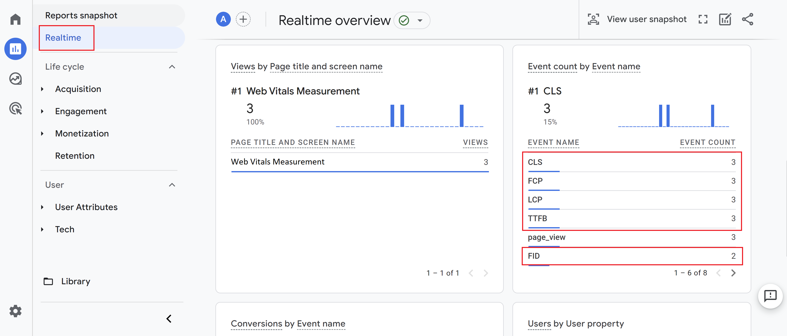

# Web Vitals Template for Google Tag Manager

## Introduction
The Web Vitals Template for Google Tag Manager is a tag to help measure [(Core) Web Vitals](https://web.dev/vitals/) field data with any analytics provider through Google Tag Manager. The instructions below will focus on Google Analytics 4 (GA4) as an analytics provider.

There are different ways to send web vitals data to GA4:

- Using the [web-vitals JavaScript library](https://github.com/GoogleChrome/web-vitals). You can find demos on how to load the web-vitals library from a CDN and how to use the npm package to measure metrics with GA4 through Google Tag Manager in this [GitHub repository](https://github.com/google-marketing-solutions/web-performance-lab/tree/main/workshop/web-vitals-lib).
- Web Vitals can be measured directly with GA4 [using the gtag.js-API](https://github.com/GoogleChrome/web-vitals#using-gtagjs-google-analytics-4).
- Using a Google Tag Manager Template from [this guide](https://www.simoahava.com/analytics/track-core-web-vitals-in-ga4-with-google-tag-manager/).

The Google Tag Manager Template from this repository is based on the [web-vitals JavaScript library](https://github.com/GoogleChrome/web-vitals) and has a similar approach like the Template from [this guide](https://www.simoahava.com/analytics/track-core-web-vitals-in-ga4-with-google-tag-manager/). Compared to the latter this Web Vitals Template provides [additional control](#tag-setup) on how to measure web vitals data.

## Prerequisites

Before you start, you will require the following:

-  A Google Tag Manager account and container
-  A Google Analytics 4 account and property

Follow [these instructions to set up and install Google Tag Manager](https://developers.google.com/tag-platform/tag-manager/web). With the help of [this Analytics help center guide](https://support.google.com/analytics/answer/9304153) you can create an Analytics account and a new Google Analytics 4 property.

## Getting Web Vitals Template into Google Tag Manager

To get started, you first need to import the template into your Google Tag Manager container. Please follow the steps below:

1. Download the template.tpl file from this repository
2. In your Google Tag Manager Web container, go to the Template section of the container and create a new Tag Template
3. In the Template editor, click the three dots in the top-right corner and select "Import"
4. Choose the downloaded template.tpl from your computer to import it
5. Save the Template

## Deploying the Web Vitals Template

After you have imported the Template into your Google Tag Manager Container head to the tag section of the container. Click on "New" and select the Web Vitals Tag. You will find the Tag within the custom tag section.

### Tag Setup

For a **quick start** you can leave the default settings as they are and just add the "All Pages" trigger to it.

For a **customized setup** you have different options to choose from:

- **Choose how to load the library:** You can load the web vitals library from the unpkg.com CDN or use a custom URL to load the library. **[For the latter please consider these instructions.](#load-library-from-a-custom-url)**
- **Build options:** When loading the library from the unpkg.com CDN you can choose between two different [build options](https://github.com/GoogleChrome/web-vitals#build-options). To get started use the standard built, to collect additional diagnostic information use the attribution build.
- **Metrics configuration:** Choose which metrics you want to measure. You can measure all metrics. Alternatively choose separately between the following metrics.
    + [Cumulative Layout Shift (CLS)](https://web.dev/cls/)
    + [First Input Delay (FID)](https://web.dev/fid/)
    + [Largest Contentful Paint (LCP)](https://web.dev/lcp/)
    + [Interaction to next Paint (INP)](https://web.dev/inp/)
    + [First Contentful Paint (FCP)](https://web.dev/fcp/)
    + [Time to First Byte (TTFB)](https://web.dev/ttfb/)
- **Event name:** Per default for every push of web vitals data into the [data layer](https://developers.google.com/tag-platform/tag-manager/datalayer) of Google Tag Manager an event property with the name "web_vitals" will be added. If you want to rename that event name, you can configure it here.

After your customization add the "All Pages" trigger to the Tag.

### Debugging

To test the Tag you have to switch to the preview mode of Google Tag Manager. Load a page of your site in preview mode, switch to your site, allow the page to load, interact with your site (e.g. by clicking on different elements) and then switch back to the preview mode to see the results.

For every enabled web vitals metrics in the Tag settings you will find a corresponding data layer push. The event name of that data layer push is visible on the left side of the preview mode. Select one of the entries and open the API Call tab to see the collected data from the web vitals Tag:

### Load library from a custom URL

To load the web vitals library from a custom URL you will first have to select the corresponding option in the Tag settings:

Enter your URL, where to load the library from, into the field. Please note that the URL must start with **https://** and must end with **.js**. To load the script to the page, the Tag template uses the [injectScript-API](https://developers.google.com/tag-platform/tag-manager/templates/api#injectscript). This API also validates that the correct permissions are enforced. This includes whether a custom template can inject JavaScript and from what origin it can do so. The URL you entered in the "Custom URL" field will therefore need permission to be injected.

Please follow the steps below to provide that permission:

1. In your Google Tag Manager Web container, go to the Template section of the container and open the imported Web Vitals Template
2. Open the "Permissions" tab
3. Open the "Injects scripts" field
4. Add your custom URL to the list
5. Save the Template

Example: If you are loading the web vitals library from ``https://www.mydomain.com/files/webVitals.js`` you need to add this URL to the list as follows.

## Data Collection with Google Analytics 4 (GA4)

To send the web vitals data to GA4 you will need to set up a trigger, data layer variables and a GA4 Tag in Google Tag Manager.

### Create the trigger

In the Google Tag Manager UI, go to "Triggers" and create a new trigger from type "Custom Event". In the event name field you should enter either the custom configured event name for the data layer push or the standard event name "web_vitals".

### Create the data layer variables

To access web vitals data from the data layer and to send those data as event parameters to GA4 you will need to create corresponding data layer variables in the Google Tag Manager Container. Example: To collect the metric name and value you have to set up the following data layer variables.

***Important note: "rating" and "delta" are important data that need to be sent in order for GA4 reporting and Looker Studio Dashboard to work properly. But please feel free to send additional data from the data layer.***

### Create a GA4 Tag

To send the data to GA4 you have to create a GA4 Event Tag. Set the data layer variable of "webVitalsData.name" as an event name, set up event parameters and choose the created trigger to make the tag fire. You can also use a event parameter called "event_category" of "Web Vitals" to group the metrics.

***Important note: Please make sure to fire this Tag based on the user consent choice.***

After successful implementation you can see the web vitals GA4 event in the realtime report immediately:

Please note that data in Google Analytics is processed with a delay of 24-48 hours. To analyze your collected web vitals data you may have to wait up to 48 hours. After that period you can analyze your data through standard reports and the GA4 explorations. Example data in standard event report:

